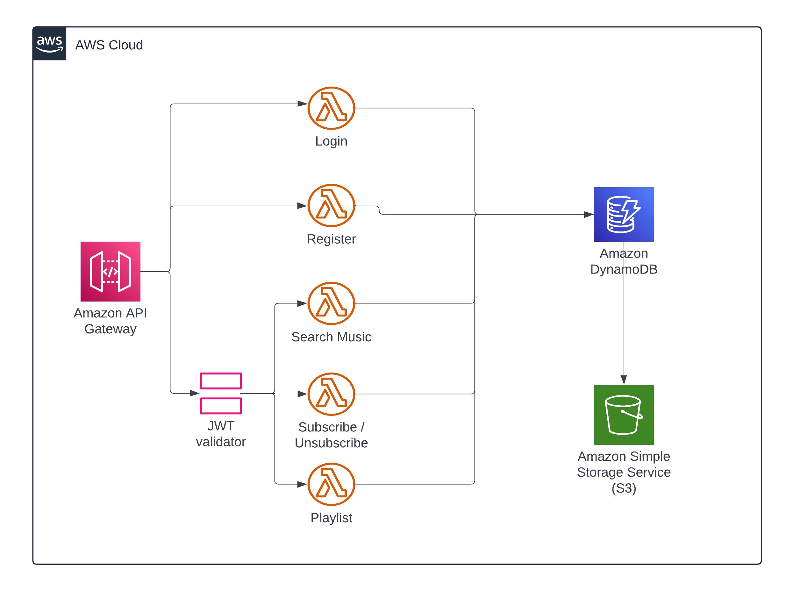

# 🎵 Music Subscription Application

A full-stack cloud-native music subscription platform allowing users to explore music albums, securely subscribe, and manage content. Built with AWS services and modern web technologies for performance, scalability, and secure access.

## 🚀 Tech Stack

### 🖥️ Frontend
- **Next.js** – Modern React-based framework for server-side rendering and routing
- **MUI (Material UI)** – Component library for a responsive, elegant UI
- **EC2 Instance** – Hosting the Next.js frontend and managing connections

### ☁️ Backend / Cloud Infrastructure
- **AWS Lambda** – Stateless, serverless functions for business logic
- **API Gateway** – RESTful endpoints to access Lambda functions securely
- **DynamoDB** – NoSQL database to store user subscriptions and music metadata
- **S3 Bucket** – For storing music album images and other static assets
- **JWT Token Validator** – Secure authentication and access control
- **Signed URLs** – Temporary, secure links to access private S3 content

## 🔐 Security Features
- JWT-based user authentication and session handling
- Token verification in Lambda with expiration checks
- Signed URLs for secure and time-limited access to private images
- Condition expressions in DynamoDB to prevent duplicate inserts

## 📦 Features
- 🎧 **Explore and Subscribe** to music albums
- 🗃️ **Optimized Queries** using DynamoDB GSIs for efficient access by title, artist, album, and year
- 💾 **Upload & Access Album Images** via S3 using pre-signed URLs
- 🔄 **Full CRUD Operations**:
  - Create and manage user subscriptions
  - List and filter music albums
  - Delete subscriptions and records
- 🔗 **Secure Connections** from frontend to backend via API Gateway and HTTPS
- ☁️ **Cloud-native deployment** using EC2 + AWS services

## 🔑 API Structure

## 🏗️ Deployment Steps
1. **Frontend Deployment**
   - Build the Next.js frontend
   - Deploy to EC2 instance using SCP or a CI/CD pipeline

2. **Backend Deployment**
   - Package Lambda functions and deploy via AWS CLI or SAM
   - Set up API Gateway routes pointing to respective Lambdas

3. **S3 Bucket**
   - Create an S3 bucket and configure CORS

4. **DynamoDB Setup**
   - Create `music` and `subscribe` tables
   - Define GSIs: `ArtistIndex`, `AlbumIndex`, `TitleIndex`, `YearIndex`

5. **Environment Variables**
   - Set access keys and tokens securely in `.env` or AWS Secrets Manager

